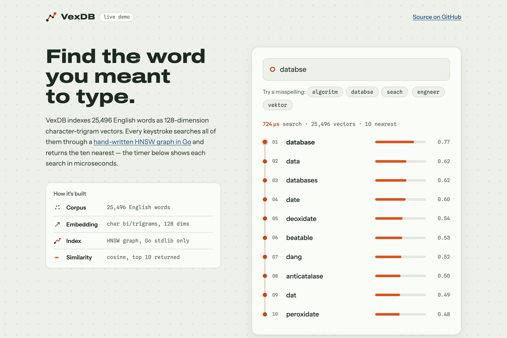

# VexDB — a vector database from scratch

A small vector search engine written in Go with **no dependencies outside the
standard library**: an HNSW index built from the paper, exact brute-force
ground truth, a write-ahead log for durability, and an HTTP API. Built to
understand — and be able to explain — what sits under every RAG stack's
`.query()` call.

**Live playground:** https://vexdb.vercel.app — typo-tolerant word search over
25K character-n-gram vectors, every keystroke an HNSW query (µs latencies shown).



## Benchmarks

20,000 vectors × 128 dims, k=10, Apple M-series (`go run ./cmd/bench`):

**Clustered data** (the shape of real embeddings — low intrinsic dimension):

| index | avg query | QPS | recall@10 |
|---|---|---|---|
| flat (exact) | 3.06 ms | 327 | 1.000 |
| hnsw ef=32 | 58 µs | 17,332 | 1.000 |
| hnsw ef=128 | 120 µs | 8,311 | 1.000 |

**53× faster at perfect recall.**

**Uniform random data** (adversarial — in high dimensions all similarities
concentrate, so there is no structure to exploit):

| index | avg query | QPS | recall@10 |
|---|---|---|---|
| flat (exact) | 3.05 ms | 328 | 1.000 |
| hnsw ef=64 | 261 µs | 3,837 | 0.491 |
| hnsw ef=256 | 893 µs | 1,120 | 0.885 |
| hnsw ef=512 | 1.55 ms | 644 | 0.980 |

The pair of tables is the point: **ANN performance claims are meaningless
without naming the data distribution.** `efSearch` is the recall/latency dial;
real embedding workloads sit near the first table.

## How HNSW works (the 60-second version)

A multi-layer graph. Layer 0 contains every vector with short-range links;
each layer above holds ~1/M of the nodes below with longer-range links —
sparse "highways". A query starts at the top, greedily rides the highways
toward the target's neighborhood, then runs a beam search (width `efSearch`)
on layer 0. Search cost grows ~logarithmically with collection size instead
of linearly.

Two implementation details that matter (both in `index/hnsw.go`):

- **Beam search with two heaps** — a min-heap frontier (expand closest first)
  and a bounded max-heap of the best `ef` seen (evict worst in O(log ef)).
  Terminates when the frontier is worse than everything kept.
- **Diversity-heuristic neighbor selection** (paper's Algorithm 4) — a
  candidate becomes a link only if it's closer to the new node than to any
  already-selected neighbor. Plain "closest M" wires up tight local cliques
  and the graph loses the long-range links that make it navigable.

## Durability

Every insert is appended to an fsync'd JSONL write-ahead log **before the
client gets its 201** — a crash never loses acknowledged data. On startup the
log replays to rebuild the index. Ordering detail learned the hard way: the
insert is validated and applied *before* the WAL append, because logging
rejected requests (a duplicate id, say) poisons the log and breaks replay.
JSONL so you can inspect the log with `tail` and `jq`; snapshotting +
compaction are the roadmap answer to replay time.

## API

```bash
go run ./cmd/vexdbd -addr :8080 -wal vexdb.wal

curl -X POST localhost:8080/vectors -d '{"id":"doc-1","vector":[0.1,0.9,...]}'
curl -X POST localhost:8080/search  -d '{"vector":[0.1,0.8,...],"k":5}'
curl localhost:8080/stats
```

Vectors are unit-normalized on write; similarity is cosine (higher = better).
Request bodies are capped at 1 MiB (413 above that).

## Tests

```bash
go test ./...
```

Includes a recall gate: HNSW must reach ≥0.9 recall@10 against the exact
index on a seeded random dataset, so a regression in graph construction
fails CI rather than silently degrading search quality.

## Roadmap

- [x] Snapshot serialization (`index/snapshot.go`) — used by the hosted playground for ~100ms cold starts
- [ ] WAL compaction into snapshots (bound replay time)
- [ ] Delete/update via tombstones
- [ ] Metadata filtering
- [ ] SIMD dot product (gonum/asm or hand-rolled NEON)
- [ ] Fine-grained locking (currently one RWMutex around the graph)
- [x] Search playground UI + hosted demo (https://vexdb.vercel.app)
